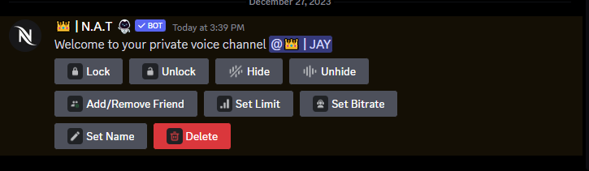

# 🎤 Private Voice

## ConveyPrivate Voice Channel Guide

### Introduction

Private voice channels offer a secure and customizable space for you and your friends to communicate. This guide outlines key features, such as lock, unlock, hide, unhide, add/remove friend, set limit, set bitrate, set name, and delete options.

### Lock and Unlock

* **Lock Button:** Ensure privacy by restricting access. Only permitted individuals can join.
* **Unlock Button:** Make the channel accessible to everyone.

### Hide and Unhide

* **Hide Button:** Conceal the channel for added confidentiality.
* **Unhide Button:** Make the channel visible for members to join.

### Add/Remove Friend

* **Add Friend:** Grant access to trusted individuals.
* **Remove Friend:** Revoke access by removing someone from the channel.

### Set Limit

* **Set Limit:** Define the maximum number of participants for an organized conversation.

### Set Bitrate

* **Set Bitrate:** Adjust voice quality. Higher bitrates offer better audio but may require more bandwidth.

### Set Name

* **Set Name:** Personalize the channel with a name reflecting its purpose or topic.

### Delete

* **Delete:** Remove unnecessary channels. Ensure members are aware before deletion.

### Usage Tips

* **Permissions:** Regularly review and adjust to limit access to trusted individuals.
* **Communication:** Clearly convey changes or restrictions to channel members.
* **Moderation:** Assign moderation roles for effective channel management.

Follow these instructions to create a secure, tailored private voice channel.

<figure><figcaption>
Voice channel control buttons
</figcaption></figure>
